# Reportes de Talleres

## Taller 1

**1.** Hacer un programa que cargue una imagen y la guarde en otros formatos (tiff, png, bmp, jpg)

**2.** Compare visualmente los resultados obtenidos en los nuevos formatos. Revise las dimensiones de las imágenes, para ver si se conserva la resolución.

### Objetivo

Guardar una imagen original en varios formatos (TIFF, PNG, BMP, JPEG) y comparar visual y numéricamente las diferencias producidas por cada formato (preservación de dimensiones, pérdidas por compresión).

### Algoritmos utilizados

- PIL (Pillow) para lectura y guardado en distintos formatos.  
- NumPy para manipulación y comparación de matrices de píxeles.  
- Matplotlib para visualización de imágenes y mapas de diferencia.  
- OpenCV (cv2) para cálculos de histograma (opcional).

### Consideraciones o explicación de la técnica utilizada

- Se guardan versiones de la misma imagen en distintos formatos usando PIL.  
- Para comparar, se convierten las imágenes guardadas a RGB con NumPy y se calcula el error absoluto medio (MAE) por par de imágenes, además de mostrar mapas de diferencias normalizados.  
- JPEG es con pérdida; PNG/TIFF/BMP se consideran sin pérdida en la configuración usada. Algunas variaciones pueden deberse a perfiles de color o metadatos.

### Imágenes generadas.

- outputs_workshop_1/converted_picture.tiff  
- outputs_workshop_1/converted_picture.png  
- outputs_workshop_1/converted_picture.bmp  
- outputs_workshop_1/converted_picture.jpeg

Comparativa (grid 2x2):

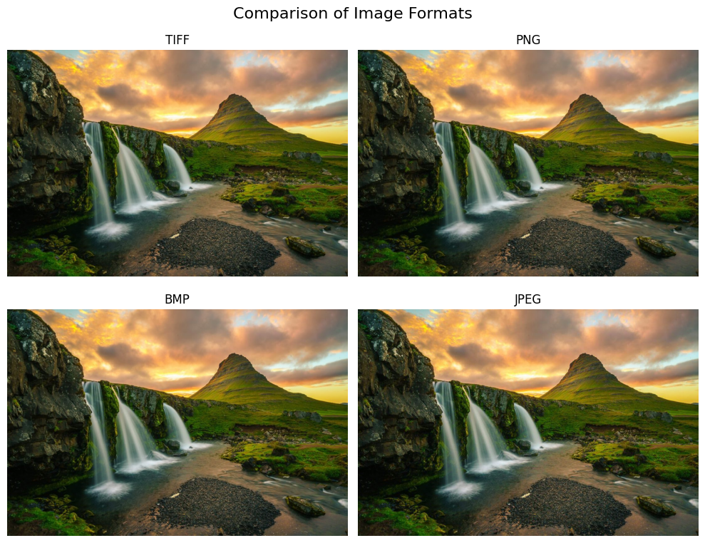

Diferencias a nivel de pixeles entre formatos:

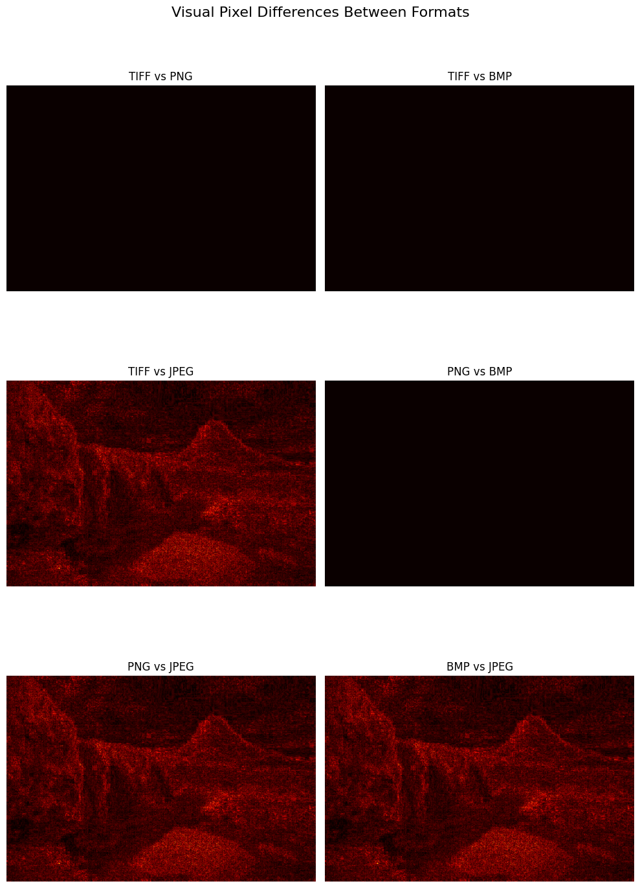

### Análisis y conclusiones.

- Las dimensiones se conservaron en todas las conversiones verificadas.  
- El formato JPEG mostró pequeñas diferencias de píxel por compresión con pérdida (MAE > 0). En el experimento registrado el MAE promedio frente a formatos sin pérdida fue pequeño (entre 1 y 2 en escala 0-255).  
- PNG/TIFF/BMP conservaron prácticamente los valores originales (MAE alrededor de 0).  
- Recomendación: usar formatos sin pérdida para preservar exactitud; usar JPEG sólo si se necesita compresión y se acepta degradación.

## Taller 2

**1.** Hacer una función para leer una imagen en formato RGB y la presente en las dos escalas de grises planteadas realizando ciclos, utilizando las siguientes ecuaciones:

$Y = 0.2989R + 0.5870G + 0.1140B$

$Y = 0.333R + 0.333G + 0.333B$

**2.** Hacer un programa que lea una imagen a color y presente la imagen en escala de grises, usando una función para escala de grises del lenguaje de programación utilizado.

**3.** Guarde las imágenes de los ejercicios
anteriores.

**4.** Analizar las diferencias presentadas entre las diferentes imágenes obtenidas.

### Objetivo
Implementar y comparar métodos de conversión a escala de grises (implementación por ciclos y función builtin), guardar los resultados y cuantificar diferencias (MAE, mapas de diferencia).

### Algoritmos utilizados
- PIL (Pillow) para lectura/guardado y conversión builtin.  
- NumPy para operaciones matriciales y conversión por ciclos.  
- Matplotlib para visualizar imágenes, histogramas y mapas de diferencia.  
- OpenCV (cv2) para cálculo de histogramas (opcional).

### Consideraciones o explicación de la técnica utilizada
- Se implementa una función que recorre cada píxel (dos versiones: pesos iguales y luminancia).  
- Se compara con la conversión builtin (PIL.Image.convert("L")) usando MAE y mapas de diferencia normalizados.  
- Guardar las imágenes permite inspección visual y reproducibilidad.

### Imágenes generadas

- Método Built-In:  

- Igual peso:
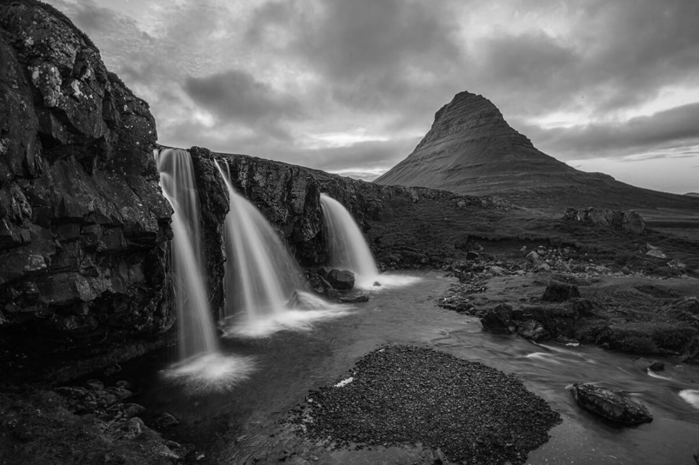

- Luminance:
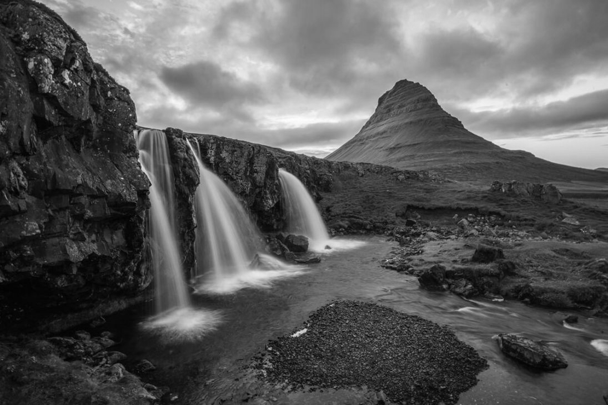

Comparativa y diferencias:

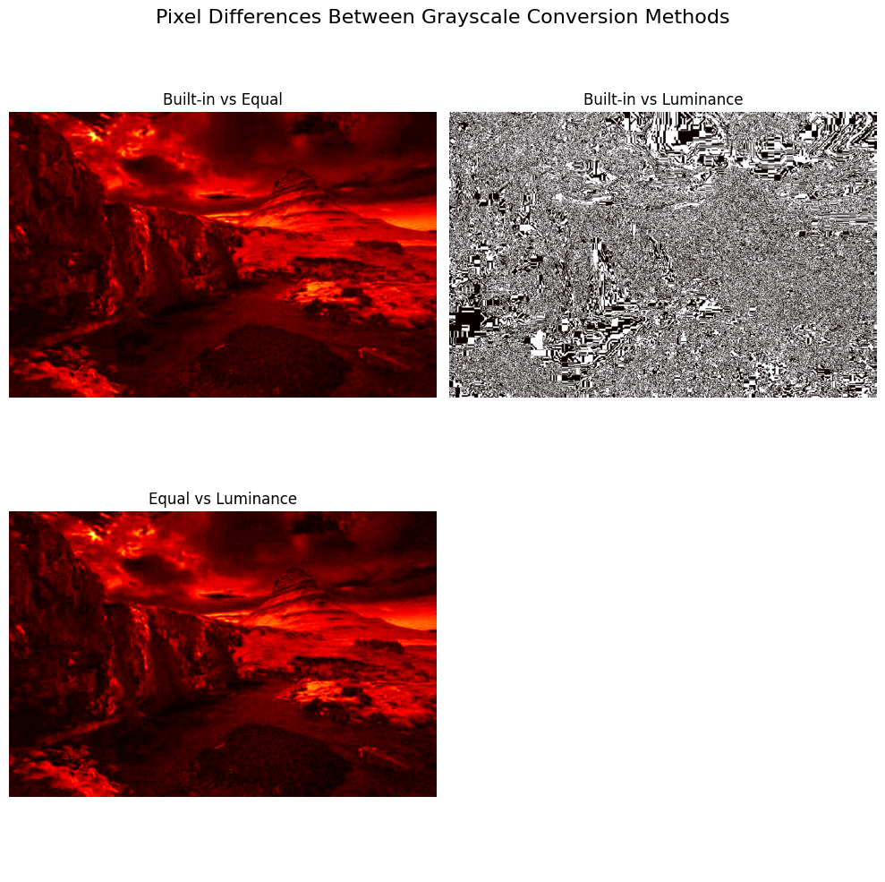

### Análisis y conclusiones
- Tamaños (alto x ancho) reportados: Built-in: (730, 1095), Equal: (730, 1095), Luminance: (730, 1095).  
- MAE (Builtin vs Equal weights): 7.29  
- MAE (Builtin vs Luminance): 0.52  
- MAE (Equal vs Luminance): 6.78

Observaciones:
- La versión con pesos de luminancia aproxima mucho mejor la conversión builtin (MAE 0.52) que la de pesos iguales (MAE 7.29).  
- Las diferencias numéricas son pequeñas en relación a la escala 0–255 pero notables entre equal vs luminance. Las discrepancias provienen principalmente de la fórmula de ponderación y del redondeo.  

Conclusión:
- Para resultados coherentes con percepción humana y con la conversión builtin, usar la fórmula de luminancia. La implementación por ciclos es útil pedagógicamente pero menos eficiente que las operaciones vectorizadas o la función builtin.

## Taller 3

**1.** Hacer un programa que lea una imagen en escala de grises y produzca el histograma correspondiente.

**2.** Hacer un programa que cargue una imagen a color y produzca el histograma con las líneas de colores RGB.

**3.** Cargar una imagen en escala de grises y hacer una función que ponga en un vector de 256 posiciones, los valores de frecuencias de pixels, usando ciclos para recorrer la imagen.

**4.** Hacer el Histograma correspondiente con el vector del ejercicio enterior.

**5.** Hacer lo mismo de los dos puntos anteriores con cada capa de una imagen en formato RGB.

### Objetivo
Generar y comparar histogramas de una imagen en escala de grises y en color; implementar un cálculo manual de frecuencias por ciclos (vector de 256 posiciones) y validar el resultado frente a la función builtin (OpenCV / NumPy). Visualizar histogramas globales y por canal.

### Algoritmos utilizados
- OpenCV (cv2) para lectura y cálculo de histograma (cv2.calcHist).  
- NumPy para manipulación de arrays y para construir el vector de frecuencias por ciclos.  
- Matplotlib para visualizar histogramas y mapas de diferencia.  
- PIL (Pillow) para cargar/convertir imágenes cuando se requiera.

### Consideraciones o explicación de la técnica utilizada
- Las imágenes se leen con cv2 (ojo: cv2 usa orden BGR). Para graficar con Matplotlib se convierte a RGB.  
- El histograma builtin (cv2.calcHist) devuelve frecuencias por intensidad; la implementación manual recorre la imagen con dos bucles y acumula en un vector de 256 posiciones (dtype int).  
- La implementación por ciclos es didáctica pero más lenta; conviene usar NumPy vectorizado para producción.  
- Al comparar resultados, diferencias pequeñas pueden aparecer por conversiones de tipo y redondeos; verificar dtype antes de comparar.

### Imágenes generadas

#### Mediante librería
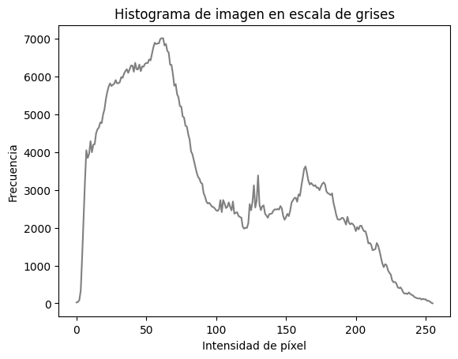

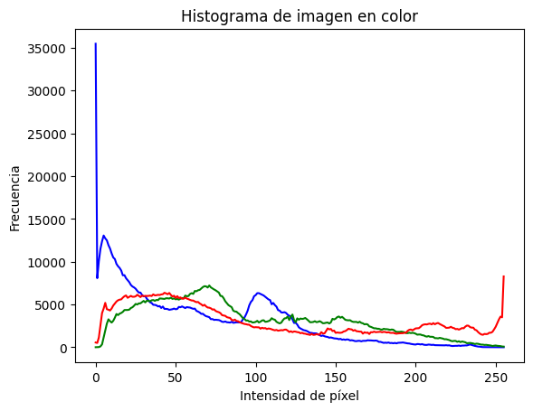

#### Mediante implementación manual
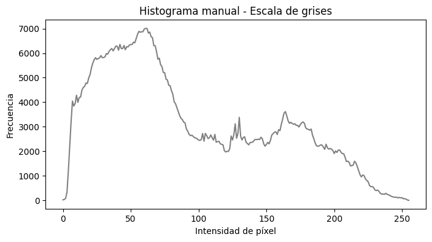

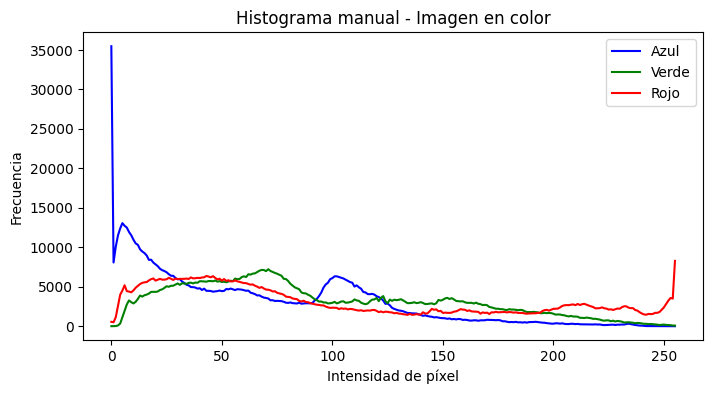

### Análisis y conclusiones
- El histograma builtin y el histograma manual coinciden (misma forma y suma total de píxeles).

- Los histogramas por canal muestran la distribución de intensidades en cada componente de color; permiten identificar sesgos de color y regiones saturadas.  

- La implementación manual confirma el proceso interno del histograma y es útil para depuración y educación, pero para eficiencia usar funciones builtin o vectorizadas.  

## Taller 4

**1.** Hacer un programa que cargue una imagen en escala de grises y produzca otra ecualizada haciendo uso de la función de ecualización brindada por el lenguaje utilizado.

**2.** Produzca una imagen comparativa entre los histogramas de las imágenes del punto anterior.

**3.** Aplicar una fórmula de ecualización para oscurecer la imagen original, oscureciendo los pixels en una tercera parte. Debe generar la imagen ecualizada y el histograma correspondiente.

**4.** Aplicar una fórmula de ecualización para aclarar la imagen original (por lo menos en un 30%). Debe generar la imagen ecualizada y el histograma correspondiente.

**5.** Aplicar una fórmula de ecualización para lograr un contraste bajo en la imagen original. Debe generar la imagen ecualizada y el histograma correspondiente.

**6.** Aplicar una fórmula de ecualización para lograr un contraste alto en la imagen original. Debe generar la imagen ecualizada y el histograma correspondiente.

**7.** Aplicar una fórmula de ecualización lineal o no lineal en una imagen a color para cada una de las capas de la imagen. Debe mostrar la imagen original, la ecualizada  y para cada capa la imagen y el histograma correspondiente.

### Objetivo
Evaluar el efecto de distintas técnicas de ecualización y transformaciones lineales/no lineales sobre imágenes en escala de grises y color, mostrando las imágenes resultantes y comparando sus histogramas para observar redistribución de intensidades.

### Algoritmos utilizados
- Ecualización de histograma (cv2.equalizeHist) sobre imagen en escala de grises.  
- Transformaciones lineales: oscurecer multiplicando por 2/3, aclarar multiplicando por 1.3, recorte/clipping.  
- Estiramiento por percentiles (recorte 5%–95%) para aumento de contraste.  
- Ecualización no lineal (corrección no lineal / gamma) aplicada por canal en color.  
- Cálculo de histogramas con cv2.calcHist y visualización con Matplotlib.

### Consideraciones o explicación de la técnica utilizada
- Las operaciones en escala de grises permiten observar directamente la redistribución de intensidades; en color se trabaja por canal o en el espacio de luminancia para evitar cambios cromáticos indeseados.  
- Todas las transformaciones usan clipping a [0,255] y conversión a uint8 antes de guardar/visualizar.  
- Los histogramas comparativos muestran la imagen original frente a la imagen transformada (o ecualizada) para cada caso.

### Imágenes generadas

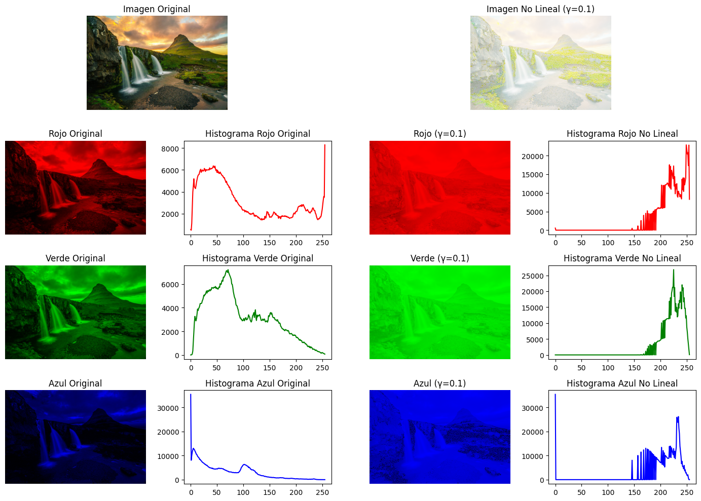  
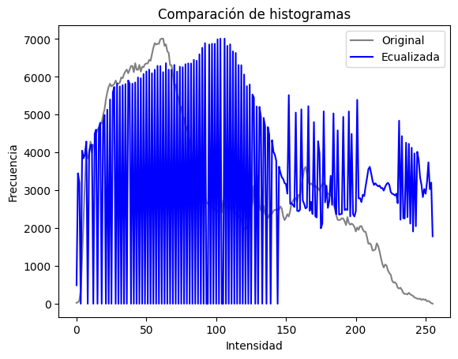  
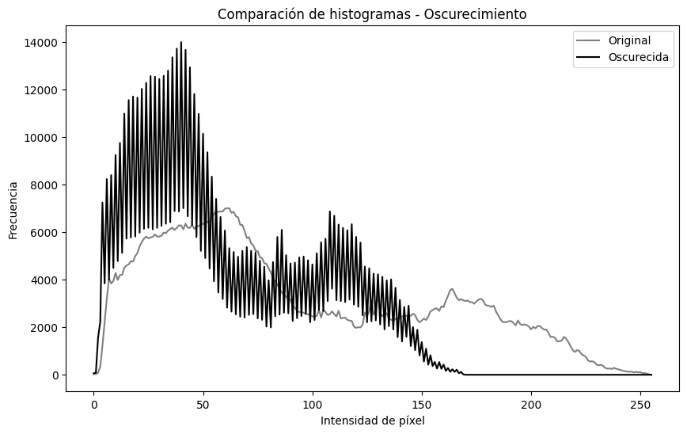  
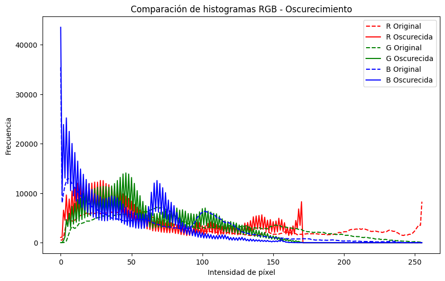  
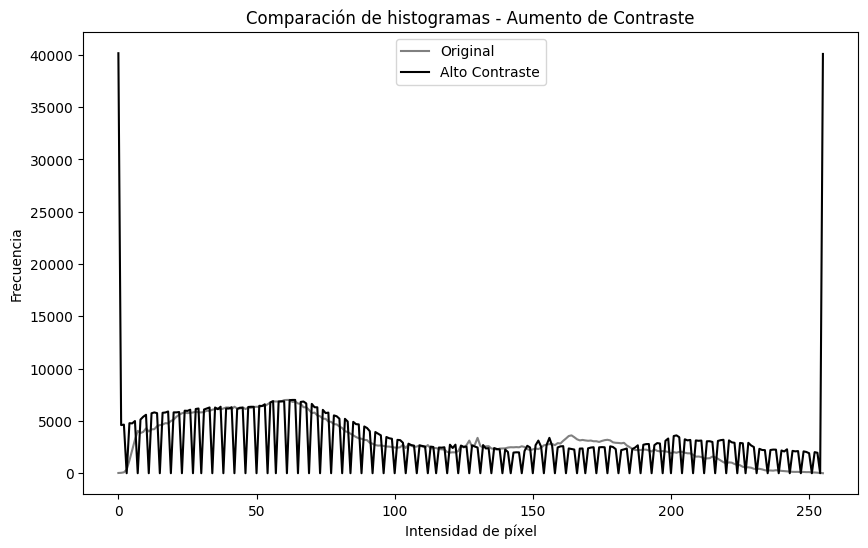  
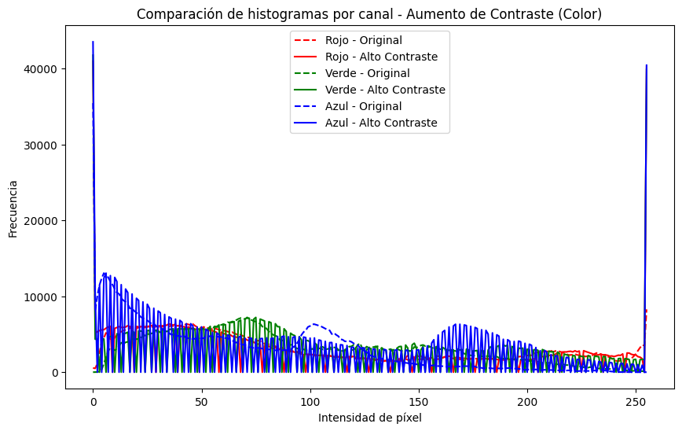  
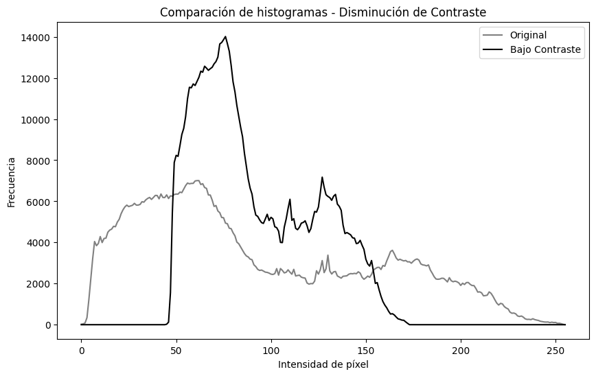  
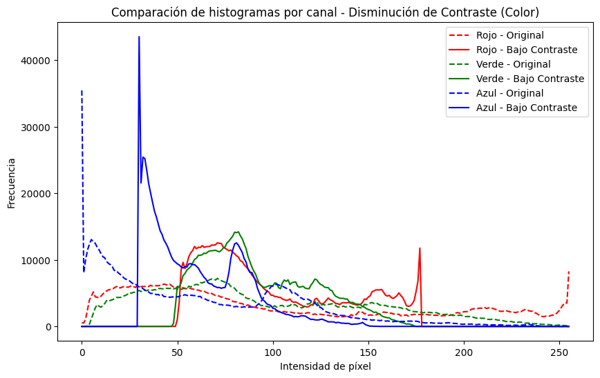  
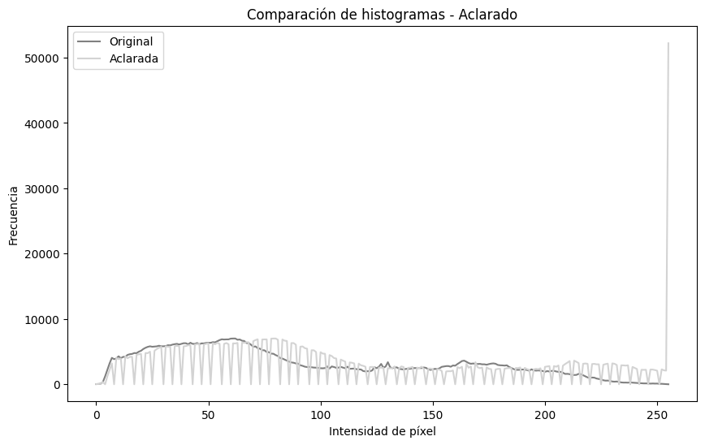  
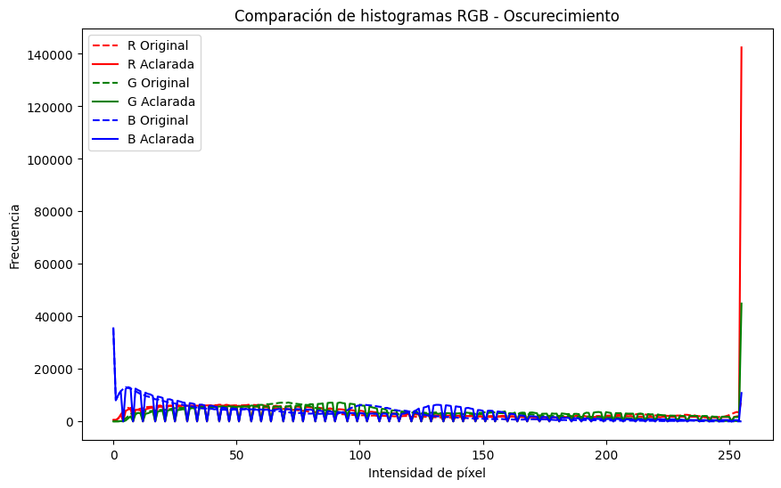  
  
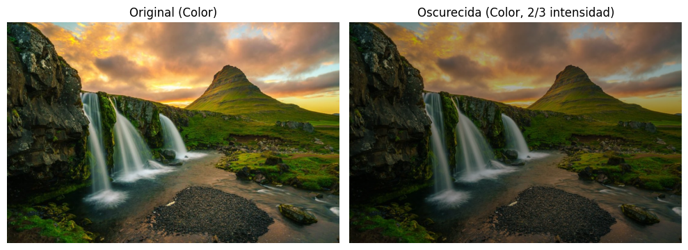  
  
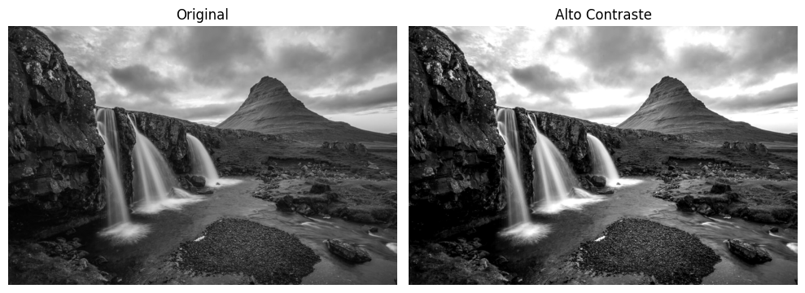  
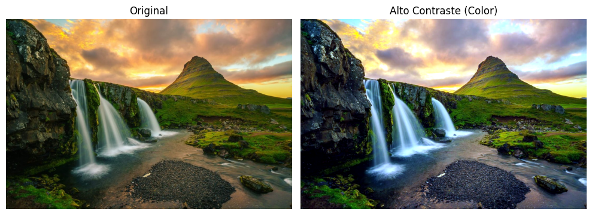  
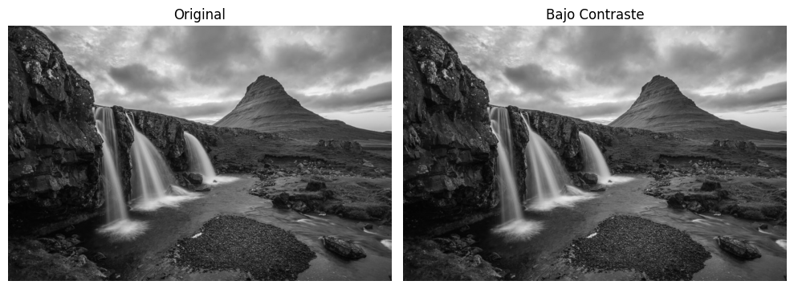  
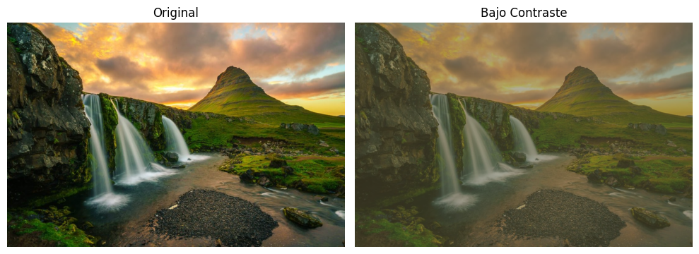  
  
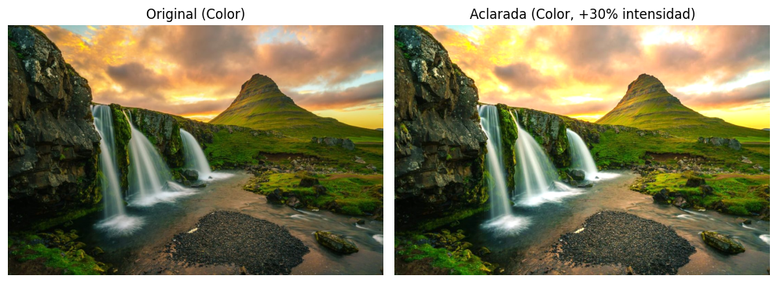

### Análisis y conclusiones
- Ecualización (builtin) redistribuye frecuencias y muestra un histograma más uniforme respecto a la original (ver orig_v_eq.png y hist_comparison.png).  
- Oscurecimiento desplaza la distribución hacia intensidades bajas; los histogramas lo reflejan con mayor masa en bins bajos (orig_v_dark.png / hist_comparison_dark.png).  
- Aclarado (+30%) desplaza la distribución hacia intensidades altas (orig_v_light.png / hist_comparison_light.png).  
- Reducción de contraste concentra frecuencias alrededor del valor medio, mientras que aumento de contraste estira la distribución hacia extremos; ambos efectos se observan en sus histogramas correspondientes (orig_v_lc.png / hist_comparison_lc.png y orig_v_hc.png / hist_comparison_hc.png).  
- Las versiones a color muestran cómo las transformaciones por canal o no lineales afectan la distribución de cada componente (ver eq_nl_color.png y los archivos *_color.png).  
- En todos los casos las figuras en outputs_workshop_4 documentan visualmente la relación entre la transformación aplicada y el cambio en los histogramas.

## Taller 5

**1.** Crear una función que permita determinar las intensidades de los Píxeles vecinos a un determinado Píxel de coordenadas definidas por el usuario. Los argumentos de entrada son la imagen y las coordenadas, y la salida una matriz con las intensidades de los 8‐vecinos del Píxel.

**2.** Probar el algoritmo con una imagen.

**3.** Probar el algoritmo con una imagen en escala de grises y con las coordenadas (82,29), (68,27), (112,89), (114,89) y (27,130) de la imagen binaria «piano.bmp»

**4.** Ejecutar la ecualización local del histograma de una imagen. Debe mostrar la imagen original, la imagen ecualizada y los histogramas de las imágenes.

**5.** Crear un programa basado en ciclos que permita adelantar la ecualización local del histograma de una imagen. Utilice la imagen “Piano.bmp” con el fin de observar los efectos causados por la ecualización (se recomienda ajustar Amin = 0.5 y Amax = 2.5).

**6.** Crear una función basada en ciclos, que permita realizar las principales operaciones lógicas entre dos imágenes. Verificar el algoritmo con las imágenes «CuadroBinGrande.pgm» y «CuadroBinChico.pgm».

### Objetivo
Documentar e implementar las técnicas pedidas en el Taller 5: obtener los 8‑vecinos de un píxel, aplicar ecualización local (biblioteca y basada en ciclos) y realizar operaciones lógicas entre imágenes binarias. Verificar los algoritmos con las imágenes provistas y mostrar resultados visuales e histogramas.

### Algoritmos utilizados
- Extracción de 8‑vecinos: recorrido local 3×3 con manejo de fronteras (padding implícito con valor 0).
- Ecualización local con biblioteca: CLAHE (OpenCV) para realce local y comparación de histogramas.
- Ecualización local basada en ciclos: ventana centrada (radio r), cálculo de media local y ajuste por factor Amin / Amax (implementación por píxel).
- Operaciones lógicas entre imágenes: AND, OR, XOR implementadas con operaciones booleanas de NumPy sobre imágenes binarias.

### Consideraciones o explicación de la técnica utilizada
- Manejo de fronteras: al solicitar vecinos en los bordes se devuelve 0 para posiciones fuera de la imagen (evita índices inválidos).
- Tipos y rangos: las operaciones sobre intensidades usan enteros 0–255; en la implementación por ciclos se trabaja en float para evitar saturación prematura y luego se reconvierte a uint8 con clipping.
- Parámetros de ecualización local: Amin < 1 aproxima los valores hacia la media local (reducción de contraste local), Amin > 1 o Amax > 1 permite aumentar contrastes locales; en la versión actual Amin=0.5 se usa por defecto (ver nota: Amax no se utiliza en la implementación mostrada y puede integrarse para efecto de realce).
- Rendimiento: la versión basada en ciclos es didáctica pero lenta para imágenes grandes; CLAHE y operaciones vectorizadas son más eficientes.

### Imágenes generadas
- (Comparación: imagen original — CLAHE — histograma comparativo entre original y CLAHE)
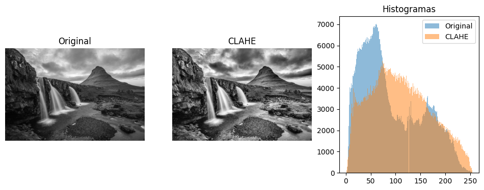

- (Resultado de la ecualización local por ciclos junto a la imagen original)
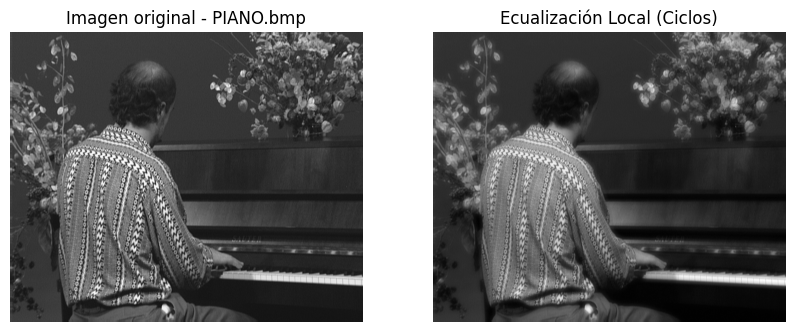

- (Imágenes resultantes de AND, OR y XOR entre CuadroBinGrande.pgm y CuadroBinChico.pgm)
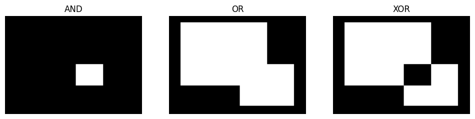  
  

### Análisis y conclusiones
- CLAHE mejora el contraste local y redistribuye las frecuencias en el histograma hacia una forma más uniforme, haciendo más visibles detalles oscuros y brillantes sin amplificar ruido de forma global.

- La ecualización local implementada por ciclos (Amin=0.5) aproxima intensidades a la media local, produciendo una reducción del contraste local (efecto de suavizado/control); cambiando Amin/Amax se obtiene desde atenuación hasta realce de contrastes locales.

- Las operaciones lógicas verifican relación espacial entre máscaras binarias: AND muestra la intersección, OR la unión y XOR la diferencia simétrica; sirven para validar correspondencia y solapamiento entre formas binarias.

## Taller 6

**1.** Desarrollar una función basada en ciclos que permita aplicar filtros paso bajo de promedio a una imagen. Los argumentos de entrada son la imagen, la máscara y la salida es la imagen filtrada. Observar los resultados obtenidos al aplicar el filtro a la imagen “Anne.pgm” para las siguientes máscaras (adicionalmente 15x15, ver los filtros en las diapositivas).

**2.** Desarrollar una función basada en ciclos que permita aplicar filtros paso bajo de la media (3x3 y 5x5) a una imagen. El argumento de entrada es la imagen y la salida es la imagen filtrada. Observar los resultados obtenidos al aplicar el filtro a una imagen en escala de grises.

**3.** Desarrollar una función basada en ciclos que permita aplicar filtros paso bajo de la mediana (3x3 y 5x5) a una imagen. El argumento de entrada es la imagen y la salida es la imagen filtrada. Observar los resultados obtenidos al aplicar el filtro a una imagen en escala de grises (puede usar gwenRuido.pgm, liraImpulsivo.pgm, toyRuidos.pgm).

**4.** Desarrollar una función basada en ciclos que permita aplicar filtros paso alto con una máscara (3x3 y 5x5) a una imagen. El argumento de entrada es la imagen y la salida es la imagen filtrada. Observar los resultados obtenidos al aplicar el filtro a una imagen en escala de grises (puede usar brain.pgm).

**5.** Aplicar el filtro de la mediana a la imagen “Gwen_saltPepper.prg”, luego aplicar el filtro paso alto. Aparece la imagen con el ruido de sal y pimienta minimizado, pero con bordes bien definidos.  Posteriormente, aplicar al filtro paso alto a la imagen original y comparar los resultados.

### Objetivo
### Algoritmos utilizados
### Consideraciones o explicación de la técnica utilizada
### Imágenes generadas.
### Análisis y conclusiones.

## Taller 7

**1.** Desarrollar una función basada en ciclos que permita realizar la transformada discreta de Fourier en 2D, aplicando el algoritmo con imágenes en escala de grises. Ejemplos de imágenes: “rectOne.pgm”, “circulo.pgm”, “liraImpulsivo.pgm”.

**2.** Visualizar el espectro de las imágenes usando escala logarítmica.

**3.** Desarrollar una función basada en ciclos, que realice la DFT en 2D usando la propiedad de separabilidad.

### Objetivo
### Algoritmos utilizados
### Consideraciones o explicación de la técnica utilizada
### Imágenes generadas.
### Análisis y conclusiones.