# Reportes de Talleres

## Taller 1

**1.** Hacer un programa que cargue una imagen y la guarde en otros formatos (tiff, png, bmp, jpg)

**2.** Compare visualmente los resultados obtenidos en los nuevos formatos. Revise las dimensiones de las imágenes, para ver si se conserva la resolución.

### Objetivo

Guardar una imagen original en varios formatos (TIFF, PNG, BMP, JPEG) y comparar visual y numéricamente las diferencias producidas por cada formato (preservación de dimensiones, pérdidas por compresión).

### Algoritmos utilizados

- PIL (Pillow) para lectura y guardado en distintos formatos.  
- NumPy para manipulación y comparación de matrices de píxeles.  
- Matplotlib para visualización de imágenes y mapas de diferencia.  
- OpenCV (cv2) para cálculos de histograma (opcional).

### Consideraciones o explicación de la técnica utilizada

- Se guardan versiones de la misma imagen en distintos formatos usando PIL.  
- Para comparar, se convierten las imágenes guardadas a RGB con NumPy y se calcula el error absoluto medio (MAE) por par de imágenes, además de mostrar mapas de diferencias normalizados.  
- JPEG es con pérdida; PNG/TIFF/BMP se consideran sin pérdida en la configuración usada. Algunas variaciones pueden deberse a perfiles de color o metadatos.

### Imágenes generadas.

- outputs_workshop_1/converted_picture.tiff  
- outputs_workshop_1/converted_picture.png  
- outputs_workshop_1/converted_picture.bmp  
- outputs_workshop_1/converted_picture.jpeg

Comparativa (grid 2x2):

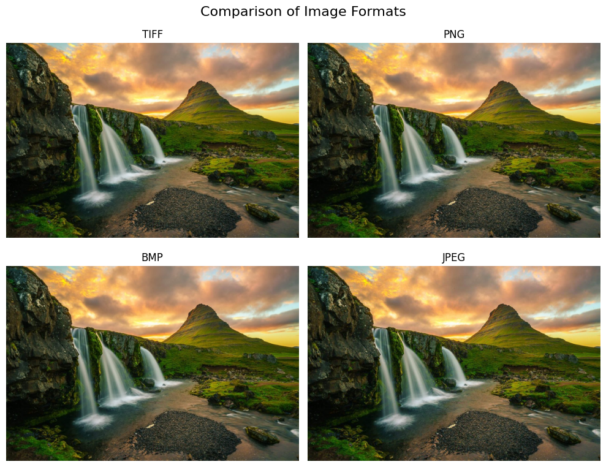

Diferencias a nivel de pixeles entre formatos:

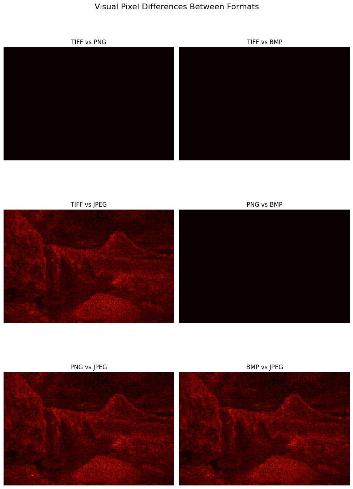

### Análisis y conclusiones.

- Las dimensiones se conservaron en todas las conversiones verificadas.  
- El formato JPEG mostró pequeñas diferencias de píxel por compresión con pérdida (MAE > 0). En el experimento registrado el MAE promedio frente a formatos sin pérdida fue pequeño (entre 1 y 2 en escala 0-255).  
- PNG/TIFF/BMP conservaron prácticamente los valores originales (MAE alrededor de 0).  
- Recomendación: usar formatos sin pérdida para preservar exactitud; usar JPEG sólo si se necesita compresión y se acepta degradación.

## Taller 2

**1.** Hacer una función para leer una imagen en formato RGB y la presente en las dos escalas de grises planteadas realizando ciclos, utilizando las siguientes ecuaciones:

$Y = 0.2989R + 0.5870G + 0.1140B$

$Y = 0.333R + 0.333G + 0.333B$

**2.** Hacer un programa que lea una imagen a color y presente la imagen en escala de grises, usando una función para escala de grises del lenguaje de programación utilizado.

**3.** Guarde las imágenes de los ejercicios
anteriores.

**4.** Analizar las diferencias presentadas entre las diferentes imágenes obtenidas.

### Objetivo
Implementar y comparar métodos de conversión a escala de grises (implementación por ciclos y función builtin), guardar los resultados y cuantificar diferencias (MAE, mapas de diferencia).

### Algoritmos utilizados
- PIL (Pillow) para lectura/guardado y conversión builtin.  
- NumPy para operaciones matriciales y conversión por ciclos.  
- Matplotlib para visualizar imágenes, histogramas y mapas de diferencia.  
- OpenCV (cv2) para cálculo de histogramas (opcional).

### Consideraciones o explicación de la técnica utilizada
- Se implementa una función que recorre cada píxel (dos versiones: pesos iguales y luminancia).  
- Se compara con la conversión builtin (PIL.Image.convert("L")) usando MAE y mapas de diferencia normalizados.  
- Guardar las imágenes permite inspección visual y reproducibilidad.

### Imágenes generadas

- Método Built-In:  

- Igual peso:
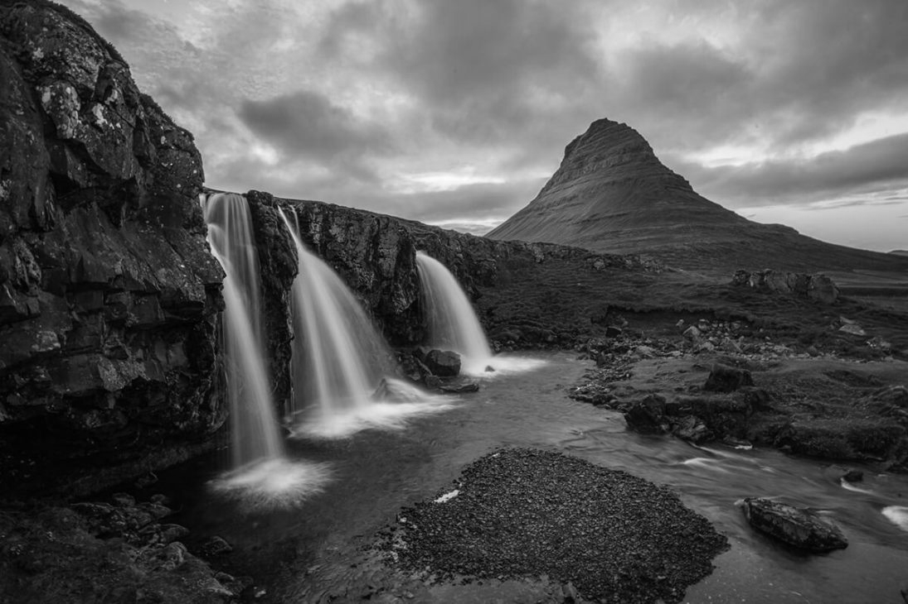

- Luminance:
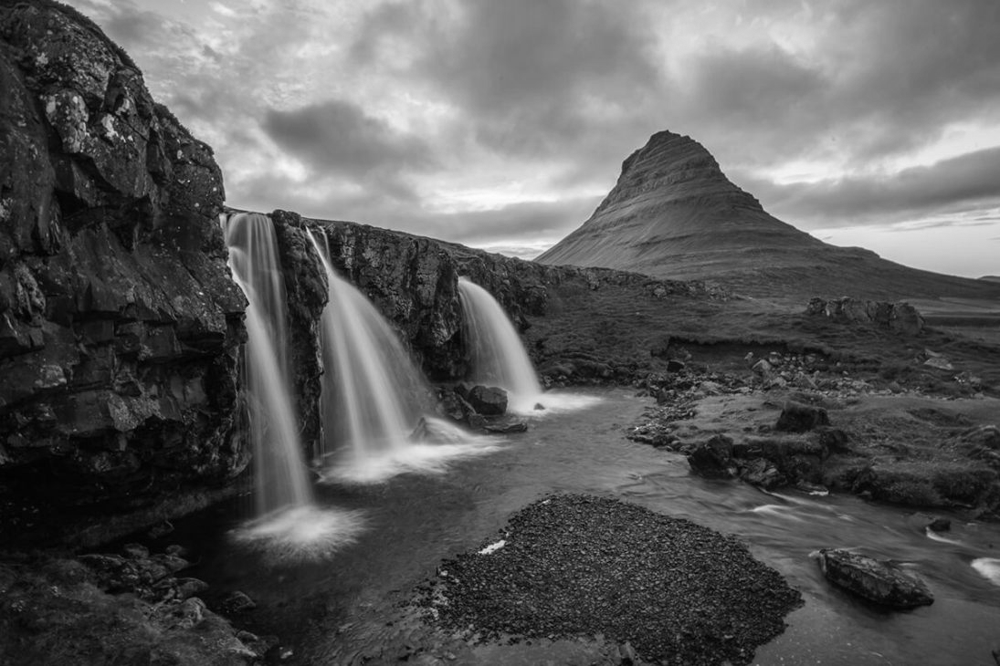

Comparativa y diferencias:

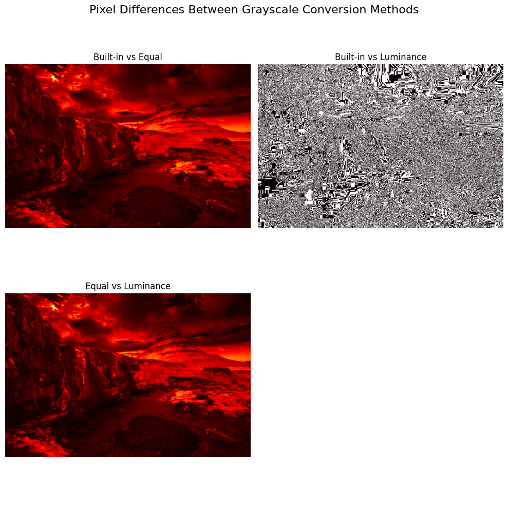

### Análisis y conclusiones
- Tamaños (alto x ancho) reportados: Built-in: (730, 1095), Equal: (730, 1095), Luminance: (730, 1095).  
- MAE (Builtin vs Equal weights): 7.29  
- MAE (Builtin vs Luminance): 0.52  
- MAE (Equal vs Luminance): 6.78

Observaciones:
- La versión con pesos de luminancia aproxima mucho mejor la conversión builtin (MAE 0.52) que la de pesos iguales (MAE 7.29).  
- Las diferencias numéricas son pequeñas en relación a la escala 0–255 pero notables entre equal vs luminance. Las discrepancias provienen principalmente de la fórmula de ponderación y del redondeo.  

Conclusión:
- Para resultados coherentes con percepción humana y con la conversión builtin, usar la fórmula de luminancia. La implementación por ciclos es útil pedagógicamente pero menos eficiente que las operaciones vectorizadas o la función builtin.

## Taller 3

**1.** Hacer un programa que lea una imagen en escala de grises y produzca el histograma correspondiente.

**2.** Hacer un programa que cargue una imagen a color y produzca el histograma con las líneas de colores RGB.

**3.** Cargar una imagen en escala de grises y hacer una función que ponga en un vector de 256 posiciones, los valores de frecuencias de pixels, usando ciclos para recorrer la imagen.

**4.** Hacer el Histograma correspondiente con el vector del ejercicio enterior.

**5.** Hacer lo mismo de los dos puntos anteriores con cada capa de una imagen en formato RGB.

### Objetivo
Generar y comparar histogramas de una imagen en escala de grises y en color; implementar un cálculo manual de frecuencias por ciclos (vector de 256 posiciones) y validar el resultado frente a la función builtin (OpenCV / NumPy). Visualizar histogramas globales y por canal.

### Algoritmos utilizados
- OpenCV (cv2) para lectura y cálculo de histograma (cv2.calcHist).  
- NumPy para manipulación de arrays y para construir el vector de frecuencias por ciclos.  
- Matplotlib para visualizar histogramas y mapas de diferencia.  
- PIL (Pillow) para cargar/convertir imágenes cuando se requiera.

### Consideraciones o explicación de la técnica utilizada
- Las imágenes se leen con cv2 (ojo: cv2 usa orden BGR). Para graficar con Matplotlib se convierte a RGB.  
- El histograma builtin (cv2.calcHist) devuelve frecuencias por intensidad; la implementación manual recorre la imagen con dos bucles y acumula en un vector de 256 posiciones (dtype int).  
- La implementación por ciclos es didáctica pero más lenta; conviene usar NumPy vectorizado para producción.  
- Al comparar resultados, diferencias pequeñas pueden aparecer por conversiones de tipo y redondeos; verificar dtype antes de comparar.

### Imágenes generadas

#### Mediante librería
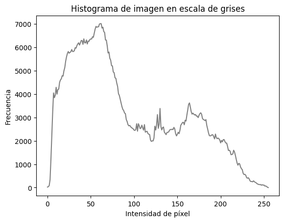

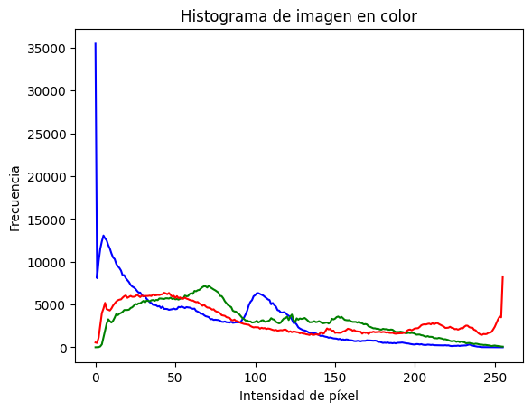

#### Mediante implementación manual
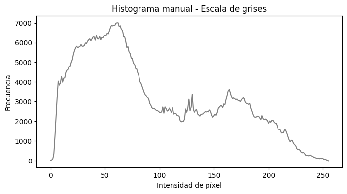

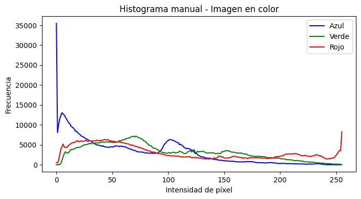

### Análisis y conclusiones
- El histograma builtin y el histograma manual coinciden (misma forma y suma total de píxeles).

- Los histogramas por canal muestran la distribución de intensidades en cada componente de color; permiten identificar sesgos de color y regiones saturadas.  

- La implementación manual confirma el proceso interno del histograma y es útil para depuración y educación, pero para eficiencia usar funciones builtin o vectorizadas.  

## Taller 4

**1.** Hacer un programa que cargue una imagen en escala de grises y produzca otra ecualizada haciendo uso de la función de ecualización brindada por el lenguaje utilizado.

**2.** Produzca una imagen comparativa entre los histogramas de las imágenes del punto anterior.

**3.** Aplicar una fórmula de ecualización para oscurecer la imagen original, oscureciendo los pixels en una tercera parte. Debe generar la imagen ecualizada y el histograma correspondiente.

**4.** Aplicar una fórmula de ecualización para aclarar la imagen original (por lo menos en un 30%). Debe generar la imagen ecualizada y el histograma correspondiente.

**5.** Aplicar una fórmula de ecualización para lograr un contraste bajo en la imagen original. Debe generar la imagen ecualizada y el histograma correspondiente.

**6.** Aplicar una fórmula de ecualización para lograr un contraste alto en la imagen original. Debe generar la imagen ecualizada y el histograma correspondiente.

**7.** Aplicar una fórmula de ecualización lineal o no lineal en una imagen a color para cada una de las capas de la imagen. Debe mostrar la imagen original, la ecualizada  y para cada capa la imagen y el histograma correspondiente.

### Objetivo
Evaluar el efecto de distintas técnicas de ecualización y transformaciones lineales/no lineales sobre imágenes en escala de grises y color, mostrando las imágenes resultantes y comparando sus histogramas para observar redistribución de intensidades.

### Algoritmos utilizados
- Ecualización de histograma (cv2.equalizeHist) sobre imagen en escala de grises.  
- Transformaciones lineales: oscurecer multiplicando por 2/3, aclarar multiplicando por 1.3, recorte/clipping.  
- Estiramiento por percentiles (recorte 5%–95%) para aumento de contraste.  
- Ecualización no lineal (corrección no lineal / gamma) aplicada por canal en color.  
- Cálculo de histogramas con cv2.calcHist y visualización con Matplotlib.

### Consideraciones o explicación de la técnica utilizada
- Las operaciones en escala de grises permiten observar directamente la redistribución de intensidades; en color se trabaja por canal o en el espacio de luminancia para evitar cambios cromáticos indeseados.  
- Todas las transformaciones usan clipping a [0,255] y conversión a uint8 antes de guardar/visualizar.  
- Los histogramas comparativos muestran la imagen original frente a la imagen transformada (o ecualizada) para cada caso.

### Imágenes generadas

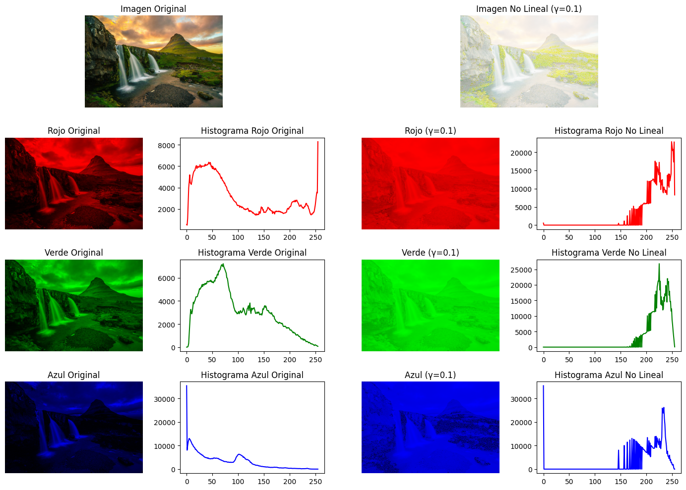  
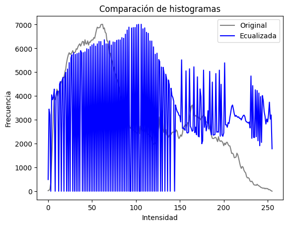  
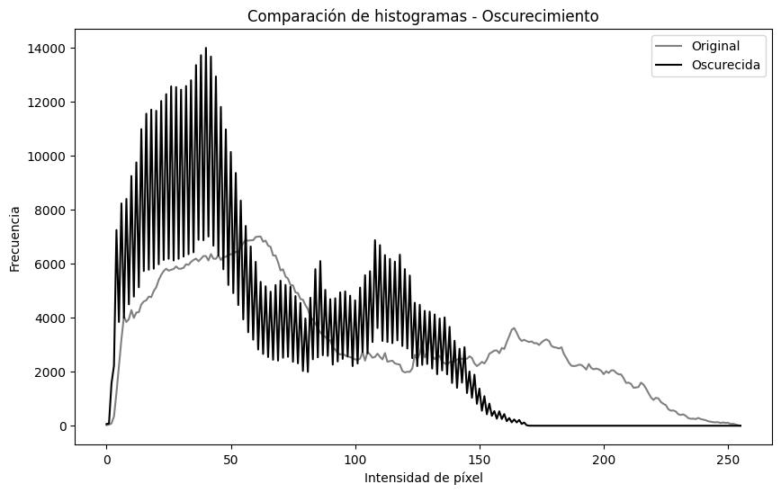  
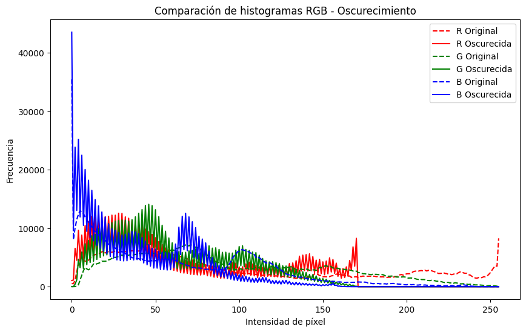  
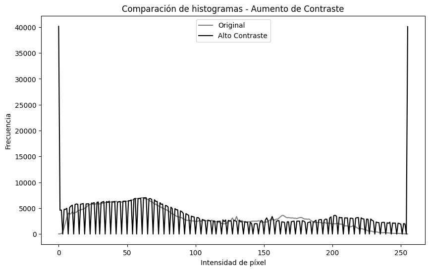  
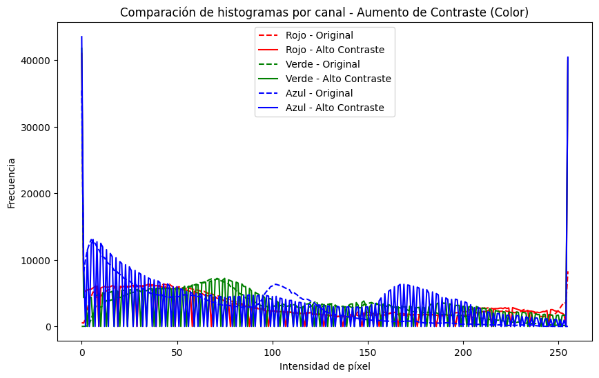  
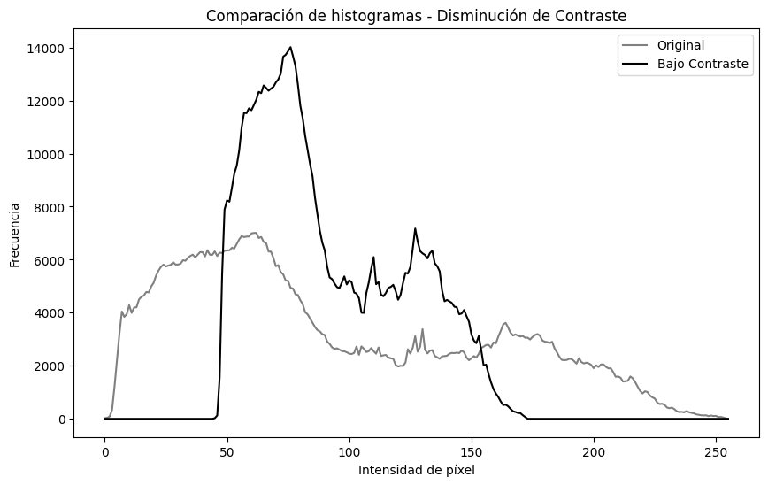  
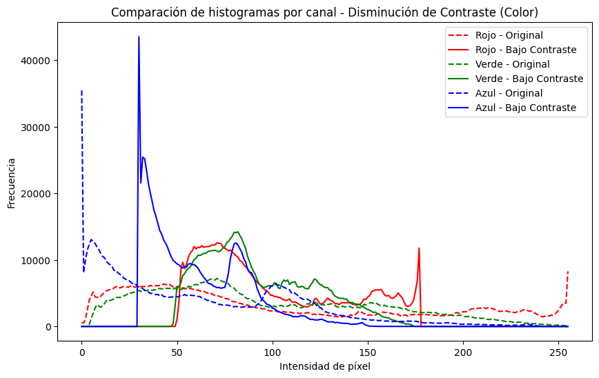  
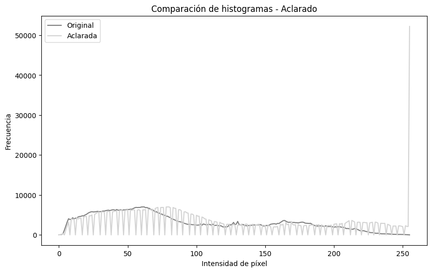  
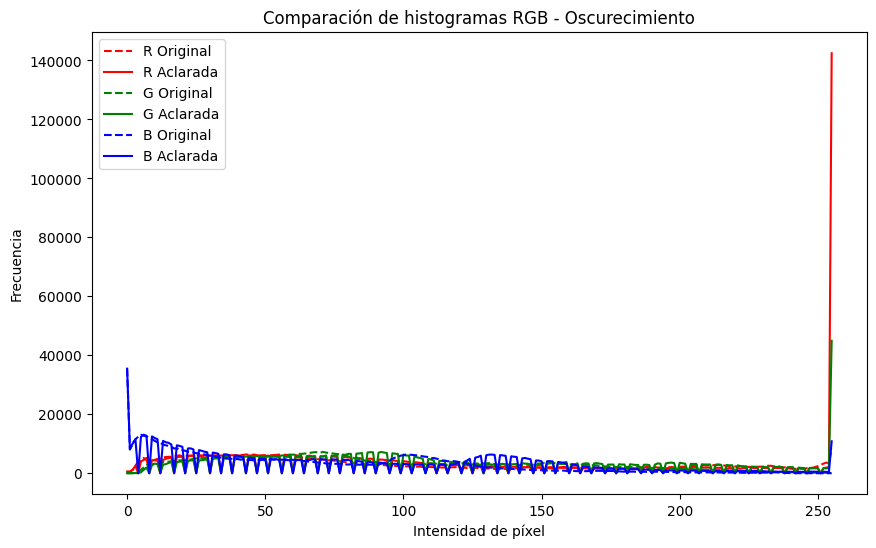  
  
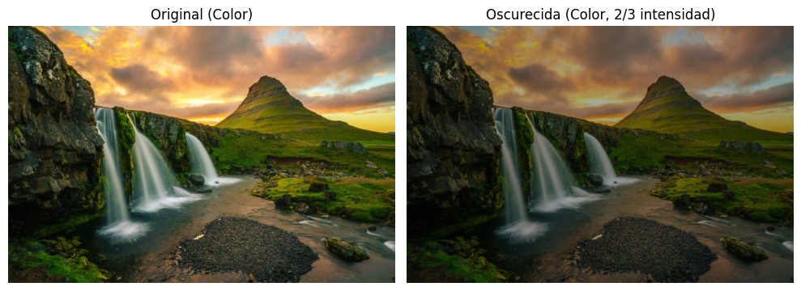  
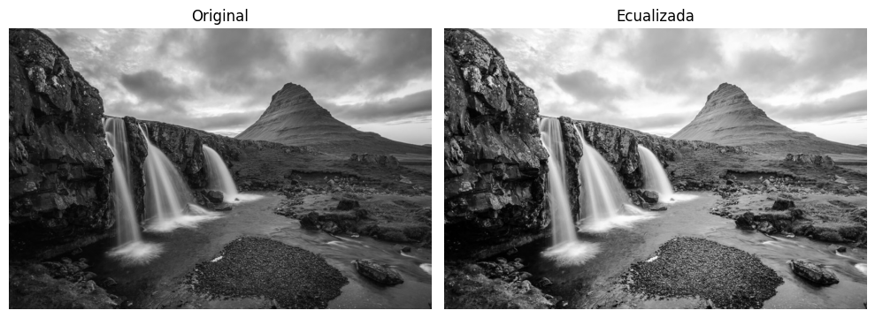  
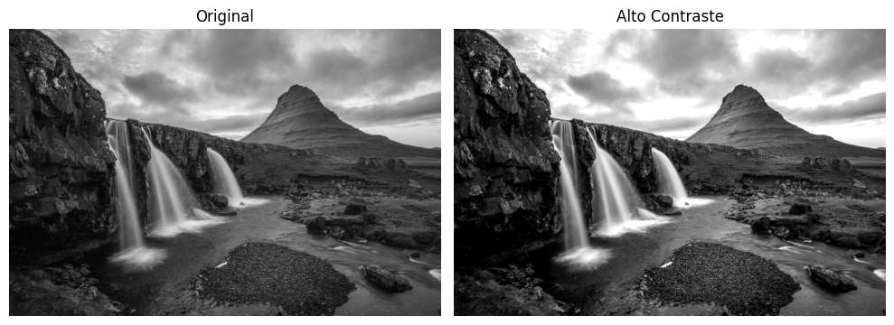  
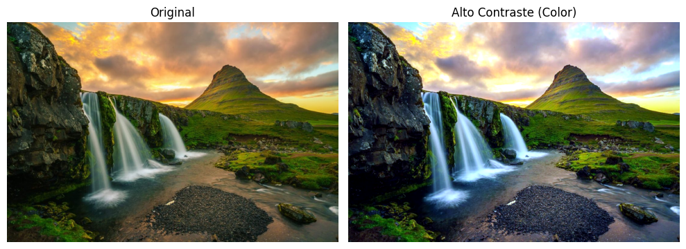  
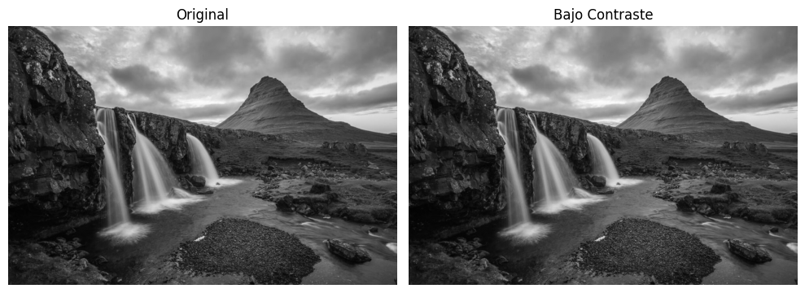  
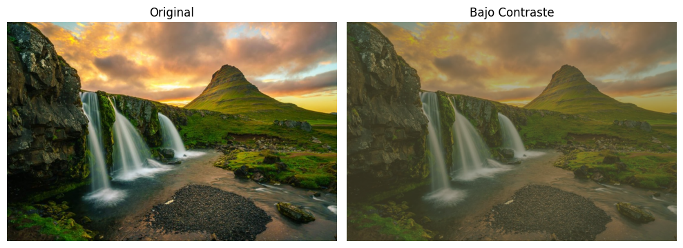  
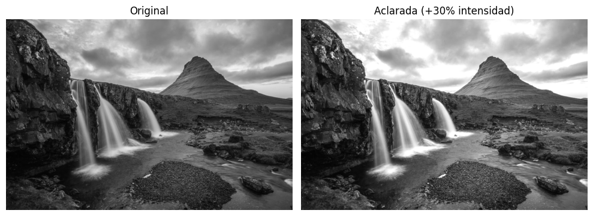  
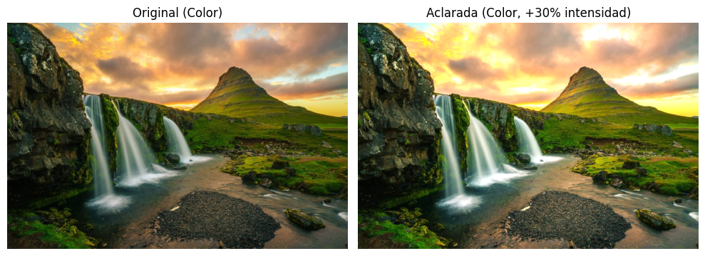

### Análisis y conclusiones
- Ecualización (builtin) redistribuye frecuencias y muestra un histograma más uniforme respecto a la original (ver orig_v_eq.png y hist_comparison.png).  
- Oscurecimiento desplaza la distribución hacia intensidades bajas; los histogramas lo reflejan con mayor masa en bins bajos (orig_v_dark.png / hist_comparison_dark.png).  
- Aclarado (+30%) desplaza la distribución hacia intensidades altas (orig_v_light.png / hist_comparison_light.png).  
- Reducción de contraste concentra frecuencias alrededor del valor medio, mientras que aumento de contraste estira la distribución hacia extremos; ambos efectos se observan en sus histogramas correspondientes (orig_v_lc.png / hist_comparison_lc.png y orig_v_hc.png / hist_comparison_hc.png).  
- Las versiones a color muestran cómo las transformaciones por canal o no lineales afectan la distribución de cada componente (ver eq_nl_color.png y los archivos *_color.png).  
- En todos los casos las figuras en outputs_workshop_4 documentan visualmente la relación entre la transformación aplicada y el cambio en los histogramas.

## Taller 5

**1.** Crear una función que permita determinar las intensidades de los Píxeles vecinos a un determinado Píxel de coordenadas definidas por el usuario. Los argumentos de entrada son la imagen y las coordenadas, y la salida una matriz con las intensidades de los 8‐vecinos del Píxel.

**2.** Probar el algoritmo con una imagen.

**3.** Probar el algoritmo con una imagen en escala de grises y con las coordenadas (82,29), (68,27), (112,89), (114,89) y (27,130) de la imagen binaria «piano.bmp»

**4.** Ejecutar la ecualización local del histograma de una imagen. Debe mostrar la imagen original, la imagen ecualizada y los histogramas de las imágenes.

**5.** Crear un programa basado en ciclos que permita adelantar la ecualización local del histograma de una imagen. Utilice la imagen “Piano.bmp” con el fin de observar los efectos causados por la ecualización (se recomienda ajustar Amin = 0.5 y Amax = 2.5).

**6.** Crear una función basada en ciclos, que permita realizar las principales operaciones lógicas entre dos imágenes. Verificar el algoritmo con las imágenes «CuadroBinGrande.pgm» y «CuadroBinChico.pgm».

### Objetivo
Documentar e implementar las técnicas pedidas en el Taller 5: obtener los 8‑vecinos de un píxel, aplicar ecualización local (biblioteca y basada en ciclos) y realizar operaciones lógicas entre imágenes binarias. Verificar los algoritmos con las imágenes provistas y mostrar resultados visuales e histogramas.

### Algoritmos utilizados
- Extracción de 8‑vecinos: recorrido local 3×3 con manejo de fronteras (padding implícito con valor 0).
- Ecualización local con biblioteca: CLAHE (OpenCV) para realce local y comparación de histogramas.
- Ecualización local basada en ciclos: ventana centrada (radio r), cálculo de media local y ajuste por factor Amin / Amax (implementación por píxel).
- Operaciones lógicas entre imágenes: AND, OR, XOR implementadas con operaciones booleanas de NumPy sobre imágenes binarias.

### Consideraciones o explicación de la técnica utilizada
- Manejo de fronteras: al solicitar vecinos en los bordes se devuelve 0 para posiciones fuera de la imagen (evita índices inválidos).
- Tipos y rangos: las operaciones sobre intensidades usan enteros 0–255; en la implementación por ciclos se trabaja en float para evitar saturación prematura y luego se reconvierte a uint8 con clipping.
- Parámetros de ecualización local: Amin < 1 aproxima los valores hacia la media local (reducción de contraste local), Amin > 1 o Amax > 1 permite aumentar contrastes locales; en la versión actual Amin=0.5 se usa por defecto (ver nota: Amax no se utiliza en la implementación mostrada y puede integrarse para efecto de realce).
- Rendimiento: la versión basada en ciclos es didáctica pero lenta para imágenes grandes; CLAHE y operaciones vectorizadas son más eficientes.

### Imágenes generadas
- (Comparación: imagen original — CLAHE — histograma comparativo entre original y CLAHE)
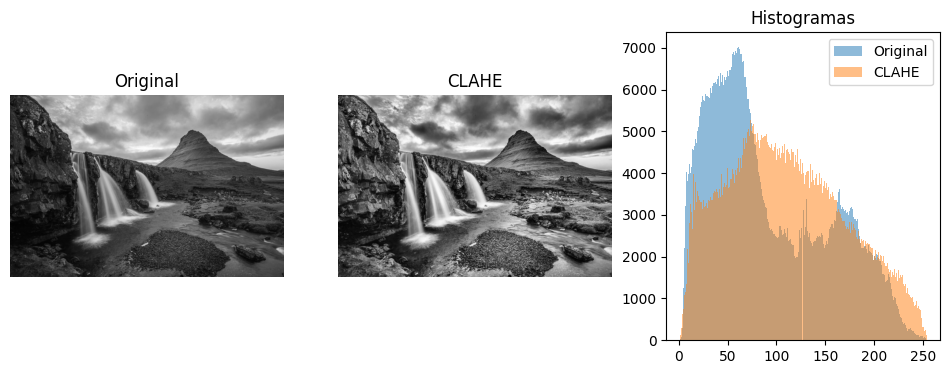

- (Resultado de la ecualización local por ciclos junto a la imagen original)
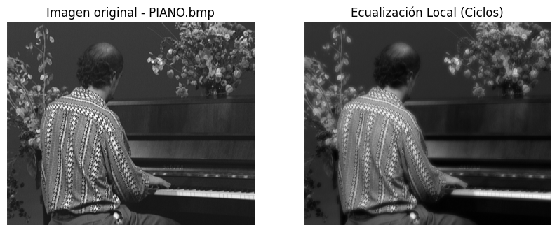

- (Imágenes resultantes de AND, OR y XOR entre CuadroBinGrande.pgm y CuadroBinChico.pgm)
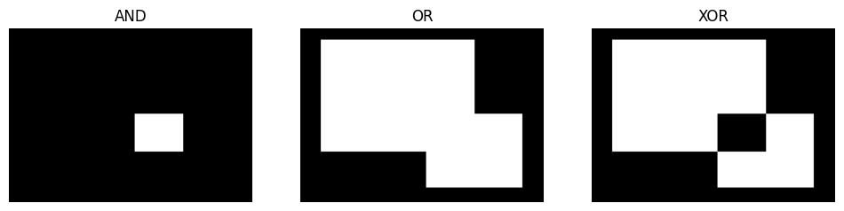  
  

### Análisis y conclusiones
- CLAHE mejora el contraste local y redistribuye las frecuencias en el histograma hacia una forma más uniforme, haciendo más visibles detalles oscuros y brillantes sin amplificar ruido de forma global.

- La ecualización local implementada por ciclos (Amin=0.5) aproxima intensidades a la media local, produciendo una reducción del contraste local (efecto de suavizado/control); cambiando Amin/Amax se obtiene desde atenuación hasta realce de contrastes locales.

- Las operaciones lógicas verifican relación espacial entre máscaras binarias: AND muestra la intersección, OR la unión y XOR la diferencia simétrica; sirven para validar correspondencia y solapamiento entre formas binarias.

## Taller 6 

**1.** Desarrollar una función basada en ciclos que permita aplicar filtros paso bajo de promedio a una imagen. Los argumentos de entrada son la imagen, la máscara y la salida es la imagen filtrada. Observar los resultados obtenidos al aplicar el filtro a la imagen “Anne.pgm” para las siguientes máscaras (adicionalmente 15x15, ver los filtros en las diapositivas).

**2.** Desarrollar una función basada en ciclos que permita aplicar filtros paso bajo de la media (3x3 y 5x5) a una imagen. El argumento de entrada es la imagen y la salida es la imagen filtrada. Observar los resultados obtenidos al aplicar el filtro a una imagen en escala de grises.

**3.** Desarrollar una función basada en ciclos que permita aplicar filtros paso bajo de la mediana (3x3 y 5x5) a una imagen. El argumento de entrada es la imagen y la salida es la imagen filtrada. Observar los resultados obtenidos al aplicar el filtro a una imagen en escala de grises (puede usar gwenRuido.pgm, liraImpulsivo.pgm, toyRuidos.pgm).

**4.** Desarrollar una función basada en ciclos que permita aplicar filtros paso alto con una máscara (3x3 y 5x5) a una imagen. El argumento de entrada es la imagen y la salida es la imagen filtrada. Observar los resultados obtenidos al aplicar el filtro a una imagen en escala de grises (puede usar brain.pgm).

**5.** Aplicar el filtro de la mediana a la imagen “Gwen_saltPepper.prg”, luego aplicar el filtro paso alto. Aparece la imagen con el ruido de sal y pimienta minimizado, pero con bordes bien definidos.  Posteriormente, aplicar al filtro paso alto a la imagen original y comparar los resultados.

### Objetivo

Implementar y analizar filtros espaciales (paso bajo, media, mediana y paso alto) sobre imágenes en escala de grises, mediante algoritmos basados en ciclos en lenguaje C, evaluando su desempeño y efectos visuales.

### Algoritmos utilizados

En este taller se emplearon los siguientes algoritmos de procesamiento espacial:

F- iltro paso bajo (promedio):
Se calcula la media de los píxeles dentro de una ventana M×M centrada en cada posición de la imagen. Este filtro atenúa variaciones abruptas y genera suavizado general.

- Filtro de la media (3×3 y 5×5):
Caso particular del filtro de promedio donde la ventana tiene tamaño fijo. Suaviza de manera más controlada y de manera proporcional al tamaño de la máscara.

- Filtro de mediana (3×3 y 5×5):
En cada ventana M×M, se ordenan los valores y se selecciona el valor central. Este filtro es especialmente eficaz eliminando ruido impulsivo (sal y pimienta) preservando los bordes mejor que los filtros de promedio.

- Filtro paso alto (máscaras 3×3 y 5×5):
Calculado mediante convolución con máscaras diseñadas para resaltar cambios bruscos de intensidad. Está orientado al realce de bordes y detalles.

- Convolución 2D implementada manualmente:
Todas las operaciones se desarrollaron usando ciclos explícitos para recorrer vecinos y aplicar las operaciones definidas por cada máscara o ventana.

- Pipeline “mediana - Paso Alto”:
Secuencia que primero elimina el ruido (especialmente impulsivo) y luego realza bordes sobre una imagen previamente limpiada.

### Consideraciones o explicación de la técnica utilizada

- Los filtros se implementaron únicamente con estructuras iterativas, evitando funciones avanzadas de librerías para cumplir con el propósito formativo del taller.

- Para manejar los bordes de la imagen se verificaron los índices de vecinos, evitando accesos fuera de los límites.

- En los filtros de promedio y media, la suavización aumenta proporcionalmente al tamaño de la ventana; ventanas más grandes producen mayor suavizado y mayor pérdida de detalle.

- El filtro de mediana requiere recolectar los valores de la ventana, ordenarlos y seleccionar el valor medio, método especialmente adecuado para ruido impulsivo.

- El filtro paso alto se basa en combinaciones lineales de los vecinos con valores positivos y negativos, lo que resalta las regiones donde existen cambios abruptos de intensidad.

- Para evitar saturaciones, los valores resultantes del paso alto se normalizan al rango [0, 255].

- El encadenamiento mediana → paso alto actúa primero reduciendo ruido y posteriormente reforzando contornos, lo cual evita que el paso alto amplifique el ruido presente.

### Imágenes generadas

Comparación entre diferentes máscaras para filtrado de paso bajo de la media:

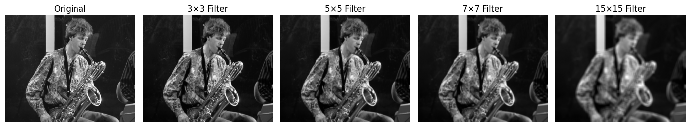

#### 1. Filtro paso bajo de la media

Media 3×3

Media 5×5

#### 2. Filtro paso bajo de la mediana
Mediana 3×3

Mediana 5×5

#### 3. Filtros paso alto
Paso alto 3×3
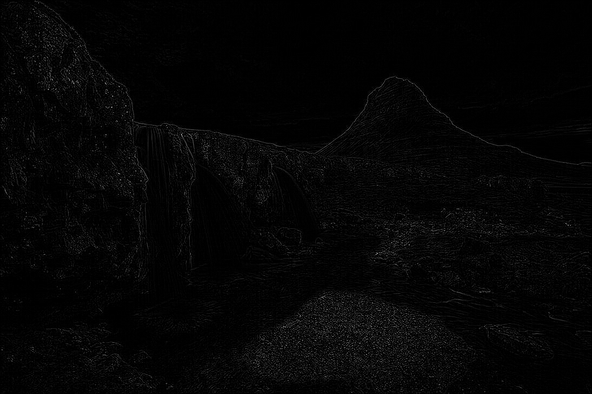

Paso alto 5×5
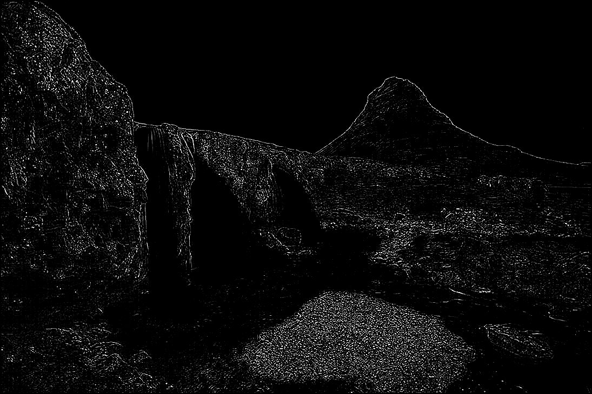

#### 5. Comparación paso alto directo vs. filtrado
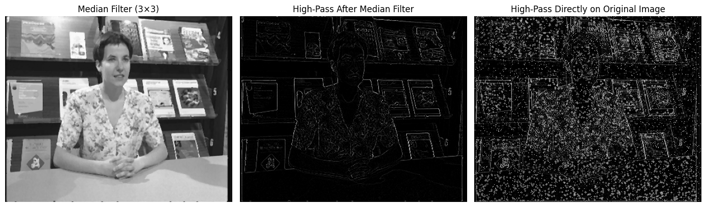

### Análisis y conclusiones

- Los filtros paso bajo (promedio y media) reducen la variabilidad de los niveles de gris y suavizan la imagen, pero sacrifican detalles y bordes al aumentar el tamaño la ventana.

- El filtro de mediana demostró ser la herramienta más eficaz para eliminar ruido impulsivo, ya que preserva los bordes mejor que los filtros de promedio o media.

- El filtro paso alto permite resaltar bordes, pero su desempeño se degrada cuando se aplica sobre imágenes con ruido, debido a que amplifica las variaciones locales e introduce artefactos.

- El pipeline mediana → paso alto resultó ser la mejor combinación:

    - Elimina el ruido original,

    - Conserva detalles relevantes,

    - Realza bordes de manera efectiva.

- Aplicar paso alto directamente a imágenes ruidosas produce resultados deficientes, con bordes falsos y pérdida de legibilidad.

En general, los resultados muestran que la calidad del preprocesamiento del ruido determina la calidad del realce posterior, y que la selección correcta del filtro depende del tipo de ruido presente en la imagen.

## Taller 7

**1.** Desarrollar una función basada en ciclos que permita realizar la transformada discreta de Fourier en 2D, aplicando el algoritmo con imágenes en escala de grises. Ejemplos de imágenes: “rectOne.pgm”, “circulo.pgm”, “liraImpulsivo.pgm”.

**2.** Visualizar el espectro de las imágenes usando escala logarítmica.

**3.** Desarrollar una función basada en ciclos, que realice la DFT en 2D usando la propiedad de separabilidad.

### Objetivo

l objetivo de esta práctica es:

1. Implementar la **Transformada Discreta de Fourier (DFT) en 2D** utilizando bucles (`for`) sobre imágenes en escala de grises.  
2. Visualizar el **espectro de magnitud** de las imágenes utilizando escala logarítmica, para resaltar detalles de frecuencia.  
3. Implementar la DFT 2D usando la **propiedad de separabilidad**, realizando primero la DFT 1D por filas y luego por columnas.  

Se utilizarán como imágenes de prueba: `rectOne.pgm`, `circulo.pgm` y `liraImpulsivo.pgm`.

### Algoritmos utilizados

#### DFT 2D directa (ciclos anidados)

La DFT 2D de una imagen  f ( x , y )  de tamaño  M × N  se define como:

$$F(u, v) = \sum_{x=0}^{M-1} \sum_{y=0}^{N-1} f(x, y) \, e^{- j 2 \pi \left( \frac{u x}{M} + \frac{v y}{N} \right)}$$

**Implementación:**

- Se usan 4 bucles anidados: `for u in M`, `for v in N`, `for x in M`, `for y in N`.  
- Cada elemento  F ( u , v )  se calcula sumando la contribución de cada pixel de la imagen multiplicado por el exponencial complejo.

#### Visualización del espectro en escala logarítmica

- La magnitud de la DFT se define como  | F ( u , v ) | .  
- Para visualizar mejor los detalles de frecuencia, se utiliza la escala logarítmica:

$$
S ( u , v )  =  \log ( 1 + | F ( u , v ) | )
$$

- Esto permite que frecuencias bajas y altas sean perceptibles en la misma imagen.  
- Se centra la componente de baja frecuencia usando `fftshift`, colocando el cero de frecuencia en el centro.

---

#### DFT 2D usando separabilidad

- La DFT es separable, lo que significa que se puede calcular primero la DFT 1D por filas y luego por columnas:

$$
F ( u , v )  =  \sum _{ x = 0 } ^{ M - 1 }  \left( \sum _{ y = 0 } ^{ N - 1 }  f ( x , y ) \, e ^{ - j 2 \pi v y / N } \right) e ^{ - j 2 \pi u x / M }
$$

**Algoritmo:**

1. Aplicar DFT 1D a cada fila de la imagen.  
2. Aplicar DFT 1D a cada columna del resultado anterior.  

**Ventaja:** reduce la complejidad computacional en comparación con los 4 bucles anidados de la DFT directa.

### Consideraciones o explicación de la técnica utilizada

- La DFT permite transformar la representación espacial de la imagen a **frecuencia**, mostrando componentes de baja y alta frecuencia.  
- La implementación con ciclos es **didáctica**, mostrando el cálculo explícito de cada punto de la DFT.  
- Para imágenes grandes, la DFT directa es muy lenta; el enfoque por **separabilidad** mejora notablemente el tiempo de ejecución.  
- La escala logarítmica es fundamental para visualizar el espectro, porque la magnitud de las frecuencias bajas domina y puede ocultar los detalles de alta frecuencia si se usa escala lineal.

### Imágenes generadas

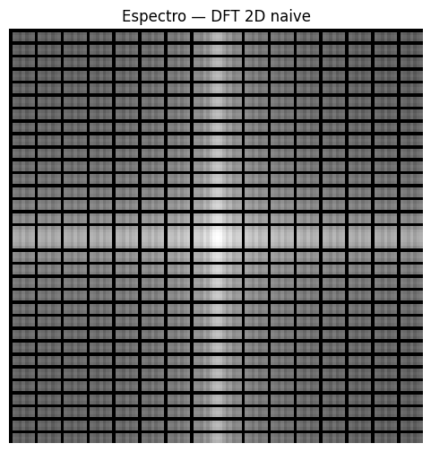
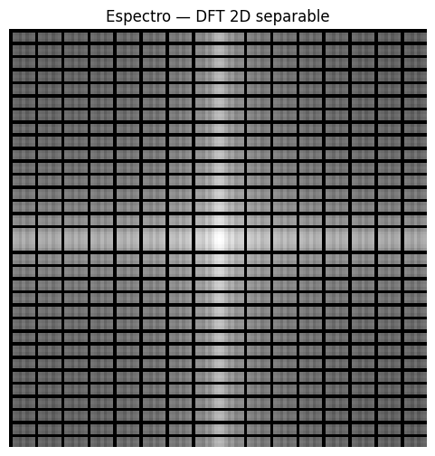

### Análisis y conclusiones

1. **DFT directa vs DFT separable:**  
   - Ambas producen resultados idénticos en magnitud y fase.  
   - La DFT separable es más eficiente, pues reduce la complejidad de  O ( M² N² )  a  O ( MN ( M + N ) ).

2. **Visualización del espectro:**  
   - La escala lineal muestra principalmente la componente de baja frecuencia.  
   - La escala logarítmica permite observar mejor los detalles de alta frecuencia, especialmente en la imagen de la lira impulsiva.

3. **Uso educativo de ciclos:**  
   - Implementar DFT con ciclos anidados ayuda a comprender la fórmula y cómo cada pixel contribuye a cada frecuencia.  
   - Para aplicaciones reales se recomienda `numpy.fft.fft2`, que es mucho más eficiente.

4. **Conclusión general:**  
   - La DFT 2D es una herramienta clave para análisis de imágenes en frecuencia.  
   - La técnica de separabilidad y la visualización logarítmica son esenciales para eficiencia y comprensión de la estructura frecuencial.

## Taller 8: Filtros Frecuencia

**1.** Desarrollar una función basada en ciclos que permita aplicar un filtro ideal pasa bajos en 2D. Recibe como entrada la imagen original y la frecuencia de corte. Probar el algoritmo con las imágenes “rectOne.pgm”, “nebulosaLira.pgm” y “gwen-pgm” con diversas frecuencias de corte.

**2.** Desarrollar una función basada en ciclos que permita aplicar un filtro Butterworth en 2D. Recibe como entrada la imagen original, la frecuencia de corte y el orden del filtro. Probar el algoritmo con las imágenes “rectOne.pgm”, “nebulosaLira.pgm” y “gwen.pgm” con diversas frecuencias de corte y diferente orden.

**3.** Desarrollar una función basada en ciclos que permita aplicar un filtro Gaussian en 2D. Recibe como entrada la imagen original y la frecuencia de corte. Probar el algoritmo con las imágenes “rectOne.pgm”, “nebulosaLira.pgm” y “gwen-pgm” con diversas frecuencias de corte. 

Puede usar frecuencias de corte de 20, 40 y 80. En caso de Butterworth, 2º orden.

**4.** Desarrollar una función basada en ciclos que permita aplicar un filtro ideal pasa altos en 2D. Recibe como entrada la imagen original y la frecuencia de corte. Probar el algoritmo con las imágenes “rectOne.pgm”, “nebulosaLira.pgm” y “gwen-pgm” con diversas frecuencias de corte.

**5.** Desarrollar una función basada en ciclos que permita aplicar un filtro pasa altos Butterworth en 2D. Recibe como entrada la imagen original, la frecuencia de corte y el orden del filtro. Probar el algoritmo con las imágenes “rectOne.pgm”, “nebulosaLira.pgm” y “gwen.pgm” con diversas frecuencias de corte y diferente orden.

**6.** Desarrollar una función basada en ciclos que permita aplicar un filtro pasa altos Gaussian en 2D. Recibe como entrada la imagen original y la frecuencia de corte. Probar el algoritmo con las imágenes “rectOne.pgm”, “nebulosaLira.pgm” y “gwen-pgm” con diversas frecuencias de corte.
Puede usar frecuencias de corte de 20, 40 y 80. En caso de Butterworth, 2º o 4º orden.

### Objetivo

El objetivo de este taller es implementar y analizar filtros ideales, Butterworth y Gaussianos en dos dimensiones dentro del dominio de la frecuencia. Estos filtros se aplican tanto en su versión pasa bajos como pasa altos, observando su efecto sobre imágenes de prueba y comparando su desempeño con distintas frecuencias de corte y órdenes (en el caso de Butterworth).

### Algoritmos utilizados

1. **Transformada de Fourier 2D (FFT)**
   - Se utiliza para convertir la imagen del dominio espacial al dominio de la frecuencia, permitiendo aplicar filtros multiplicativos.

2. **Filtros Ideales (LPF y HPF)**
   - Definidos por una función binaria, donde las frecuencias dentro del radio de corte se mantienen y las demás se anulan (o viceversa para HPF).

3. **Filtros Butterworth (LPF y HPF)**
   - Suavizan la transición entre frecuencias permitidas y rechazadas.
   - Incluyen un parámetro de orden que afecta la pendiente del filtro.

4. **Filtros Gaussianos (LPF y HPF)**
   - Definen una transición suave basada en una función exponencial.
   - No presentan artefactos de ringing como los filtros ideales.

5. **Transformada Inversa de Fourier**
   - Permite llevar los resultados filtrados nuevamente al dominio espacial.

### Consideraciones o explicación de la técnica utilizada

- Para cada filtro se construyó una **máscara H(u, v)** basada en ciclos usando las fórmulas analíticas correspondientes.
- La imagen se centra en frecuencia usando `fftshift`, se multiplica por la máscara, y luego se invierte la transformada.
- Se probaron distintas **frecuencias de corte (20, 40, 80)** para analizar el efecto del tamaño del filtro.
- En el filtro Butterworth se emplearon órdenes **n = 2 y n = 4**, permitiendo observar cómo aumenta la selectividad conforme se incrementa el orden.
- Las imágenes utilizadas muestran diferentes características (bordes definidos, texturas suaves, ruido), permitiendo evaluar la respuesta de cada filtro.

### Imágenes generadas
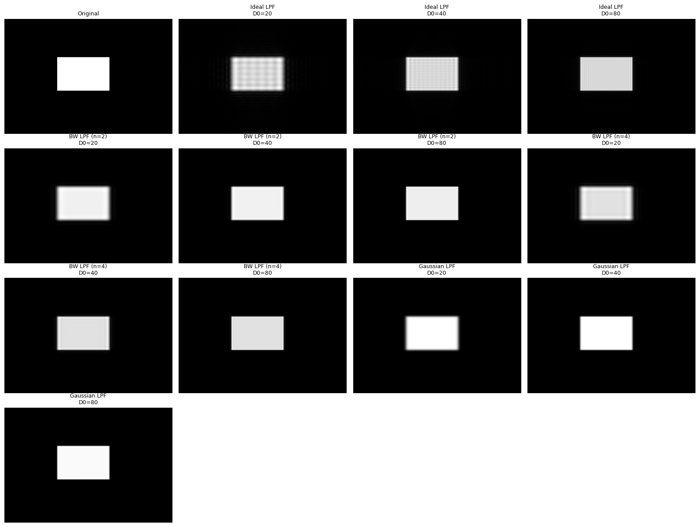
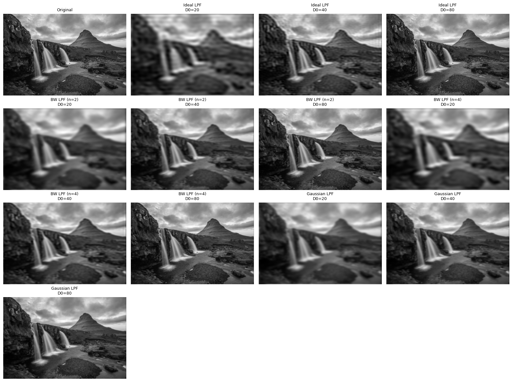

### Análisis y conclusiones

- Los **filtros ideales** producen resultados fuertes y definidos, pero generan **artefactos de ringing** debido a la discontinuidad en el dominio de la frecuencia.
- Los **filtros Butterworth** suavizan la transición, y al aumentar el orden se comportan de forma más parecida al filtro ideal, pero sin el ringing tan pronunciado.
- Los **filtros Gaussianos** resultan ser los más suaves y naturales, sin artefactos visibles, lo que los hace adecuados para aplicaciones donde se desea minimizar el ruido sin degradar excesivamente la imagen.
- A frecuencias de corte bajas (D0 = 20), todos los filtros realizan un suavizado agresivo. A valores altos (D0 = 80), la imagen preserva más detalles.
- Los filtros pasa altos son útiles para resaltar bordes y detalles finos, especialmente los Gaussianos por su suavidad.

En general, la elección del filtro depende del balance entre suavidad, preservación de detalles y presencia de artefactos. Los Gaussianos suelen ofrecer la mejor relación calidad–suavidad, mientras que los Ideales son útiles para análisis pero no tanto para uso práctico.

## Taller 9: Segmentación

**1.** Desarrollar una función basada en ciclos que permita detectar puntos aislados en una imagen. Verificar el funcionamiento con la imagen “Liraimpulsivo.pgm”. Eliminar el término promedio (1/9), ejecutar de nuevo el programa, observar y concluir.

**2.** Desarrollar una función basada en ciclos que permita detectar líneas horizontales, verticales y diagonales en una imagen. Verificar el funcionamiento con la imagen “FormasRuido.pgm”. Establecer un umbral apropiado para visualizar solo trazos deseados.

**3.** Desarrollar una función basada en ciclos que permita detectar bordes en una imagen usando la máscara Prewitt. Verificar el funcionamiento con la imagen “Gwen.pgm” y otras imágenes..

**4.** Desarrollar una función basada en ciclos que permita detectar bordes en una imagen usando la máscara Sobel. Verificar el funcionamiento con las mismas imágenes del punto anterior..

**5.** Desarrollar una función basada en ciclos que permita detectar bordes en una imagen usando la máscara Laplaciano. Verificar el funcionamiento con la imagen “Gwen.pgm” y otras imágenes.

**6.** Desarrollar una función basada en ciclos que permita detectar bordes en una imagen usando el algoritmo de Marr Hildreth. Verificar el funcionamiento con las mismas imágenes del punto anterior.

**7.** Desarrollar una función basada en ciclos que permita detectar bordes en una imagen usando la máscara Canny. Verificar el funcionamiento con la imagen “Gwen.pgm” y otras imágenes. Utilizar sigma = 5.

### Objetivo

Implementar y analizar diferentes algoritmos basados en convolución y
operaciones locales para la detección de puntos aislados, líneas y
bordes en imágenes digitales utilizando ciclos y máscaras clásicas en
procesamiento de imágenes.

### Algoritmos utilizados

1.  **Detección de puntos aislados**
    -   Basada en una máscara de realce que resalta valores que difieren significativamente del vecindario.
    -   Se realizaron pruebas con y sin el término promedio (1/9) sobre la imagen *Liraimpulsivo.pgm*.
2.  **Detección de líneas horizontales, verticales y diagonales**
    -   Implementación mediante máscaras específicas para cada orientación.
    -   Aplicada a la imagen *FormasRuido.pgm* con ajuste manual de umbral.
3.  **Detección de bordes con Prewitt**
    -   Uso de máscaras (G_x) y (G_y) mediante iteraciones explícitas.
    -   Probada con *Gwen.pgm*
4.  **Detección de bordes con Sobel**
    -   Variante más sensible que Prewitt con pesos adicionales.
    -   Probada con las mismas imágenes que el punto anterior.
5.  **Detección de bordes con Laplaciano**
    -   Método de segunda derivada para resaltar cambios abruptos.
    -   Probado con *Gwen.pgm*.
6.  **Detección de bordes con Marr--Hildreth**
    -   Suavizado con Gaussiana y posterior Laplaciano del Gaussiano (LoG).
    -   Se detectan cruces por cero.
    -   Probado con *Gwen.pgm*.
7.  **Detección de bordes con Canny**
    -   Implementación basada en ciclos: suavizado gaussiano, gradiente, supresión no máxima y umbral con histéresis.
    -   Se utilizó sigma = 5.
    -   Probado con varias imágenes.

### Imágenes generadas
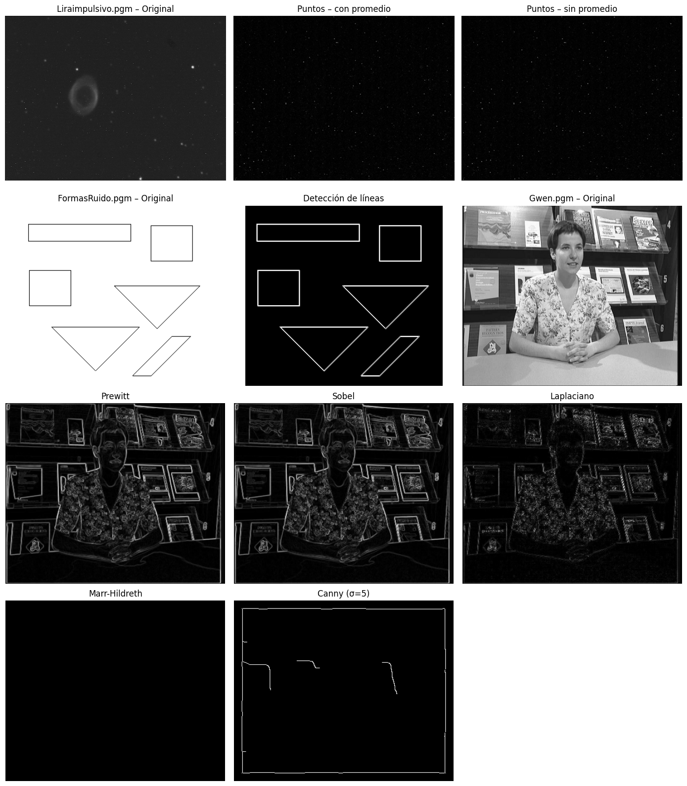

### Consideraciones o explicación de la técnica utilizada

-   Todos los algoritmos fueron implementados mediante ciclos anidados, evitando el uso de funciones de convolución externas, para comprender el proceso interno pixel por pixel.
-   Para cada técnica se manejaron bordes mediante padding controlado o ignorando píxeles exteriores.
-   Se utilizaron máscaras clásicas normalizadas donde corresponde, y umbrales ajustados experimentalmente.
-   En el caso de Canny y Marr--Hildreth, se aplicaron operaciones más complejas como suavizado previo, cálculo de gradiente y detección de cruces por cero.

### Análisis y conclusiones

-   En la detección de puntos aislados, eliminar el término promedio aumenta drásticamente la sensibilidad al ruido, generando más falsos positivos. El uso del promedio estabiliza la respuesta.
-   En la imagen *FormasRuido.pgm*, la detección de líneas depende fuertemente del umbral; valores demasiado bajos introducen ruido y valores muy altos eliminan trazos válidos.
-   Prewitt y Sobel producen resultados similares, aunque Sobel ofrece mayor énfasis en bordes fuertes debido a su ponderación.
-   El Laplaciano detecta bordes más delgados pero también es muy sensible al ruido.
-   Marr--Hildreth genera bordes continuos y suaves gracias al filtrado Gaussian previo, aunque puede generar doble borde.
-   Canny fue el método más robusto: produce bordes definidos, continuos y con poco ruido, especialmente con sigma = 5.
-   En conjunto, los algoritmos permiten observar cómo diferentes aproximaciones a la derivada (primera o segunda) afectan la detección de bordes y la sensibilidad al ruido.

